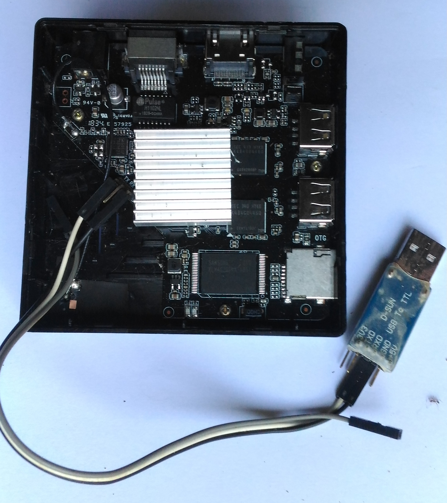

# hk1-mini
Slackware / Ubuntu on hk1 mini

Issue: kernel is not SMP. Use command line paratmeter maxcpus=1 to get system up.
System gets hung as soon as another core is enabled using 
  
    echo 1 > /sys/devices/system/cpu/cpuX/online  or so. 

Looks like this same issue is there even with the android kernel & dtb file, when used with slackware etc, 
that comes on the emmc. It is worth looking at the android init process since there is no such problem when 
running android!

Slackware 14.2

make a bootable sd card:

## method 1:
        
    dd if=./boot.hk1.mini/idbloader.img of=/dev/sdX seek=$((0x40))
    dd if=./boot.hk1.mini/uboot.img of=/dev/sdX seek=$((0x4000)) conv=notrunc # $((0x4000))
    dd if=./boot.hk1.mini/trust.img of=/dev/sdX seek=$((0x6000)) conv=notrunc # $((0x6000))
  
### create a new partition like:

    Device     Boot  Start      End  Sectors  Id Type
    /dev/sdX1        32768 31116287 31083520  83 Linux
        
    partprobe /dev/sdX
    mkfs.ext4 /dev/sdX1
   
    mount and copy : rk3229-evb.dtb, extlinux/, zImage, initrd-armv7.gz ( for slackware setup )
  
    use appropriate extlinux/extlinux.conf for setup 
  
    Copy Slackware for arm install files to Slackware-14.2
  
    boot to setup
  
    install from pre mounted directory /mnt/slackware-14.2/slackware 
  
    once installation is finished use extlinux/extlinux.conf for slackware.
  
    remember to add either a swap partition or file
  
    reboot!
 
## method 2:
  
    dd if=./sdcard.first10MB.img of=/dev/sdX 
  
    fdisk /dev/sdX and continue as above.
  
  
 ### Ubuntu. using ubuntu-mate 16.04 for raspberry pi:
 
    setup bootable sdcard as above. get ubuntu ubuntu-mate-16.04.2-desktop-armhf-raspberry-pi.img.gz

    /sbin/fdisk -l ./ubuntu-mate-16.04.2-desktop-armhf-raspberry-pi.img
     
    Disk ubuntu-mate-16.04.2-desktop-armhf-raspberry-pi.img: 4.7 GiB, 5000000000 bytes, 9765625 sectors
    Units: sectors of 1 * 512 = 512 bytes
    Sector size (logical/physical): 512 bytes / 512 bytes
    I/O size (minimum/optimal): 512 bytes / 512 bytes
    Disklabel type: dos
    Disk identifier: 0x1d8c09f0

    Device Boot  Start     End  Sectors  Size Id Type
    ubuntu-mate-16.04.2-desktop-armhf-raspberry-pi.img1        2048  131071  129024   63M  c W95 FAT
    ubuntu-mate-16.04.2-desktop-armhf-raspberry-pi.img2      131072 9764863 9633792  4.6G 83 Linux

  
now mount second partition like:

    mount -o loop,offset=$((131072*512)) ubuntu-mate-16.04.2-desktop-armhf-raspberry-pi.img /cdrom -r/cdrom -r  
 
    mount /dev/sdX1 /mnt
    rsync -az /cdrom/ /mnt
    or for multiple distributions on same partition, something like:
    rsync -az /cdrom/ /mnt/ubuntumate16.04/

edit /etc/fstab to remove boot mount, and also change root to /dev/sdX1

    proc            /proc           proc    defaults          0       0
    /dev/mmcblk0p1  /               ext4   defaults,noatime  0       1
    # /dev/mmcblk0p1  /boot/          vfat    defaults          0       2
    /swap.img       swap            swap    defaults        0  0

extlinux same for slackware ( not slackware setup )

remember to add either a swap partition or swap file.

reboot!

### Swap:

    # 2GB
    dd if=/dev/zero of=swap.img count=$((1024*1024*2*2)
    mkswap swap.img
    swapon swap.img

    /etc/fstab:
    /swap.img swap swap defaults 0 0

## Keeping multiple distributions on same SD card:

eg, once slackware is installed and ok:

    mount sdcard to /mnt
    cd /mnt
    mkdir slackware-14.2
    mv * slackware-14.2
    mv slackware-14.2/{zImage, extlinux/, *dtb, initrd*} .
    ln -s slackware-14.2/* .
    sync
    
### similarly move files for other distributions too.

    mount sdcard to /mnt
    cd /mnt
    mkdir ubuntu-mate-16.04
    mv * ubuntu-mate-16.04
    mv ubuntu-mate-16.04/{slackware-14.2, *dtb, zImage, extlinux/, initrd*} .

	or for direct installation to subdir from image:

    rsync -az /cdrom/ ubuntu-mate-16.04

## Debug through serial port

use a PL2303 type usb-serial dongle, connect to the serial port on boar ( need soldering ). see 
[connection](https://github.com/gv1/hk1-mini/hk1.mini+pl2303.jpg).

using minicom:
        
    port /dev/ttyUSB0
    8n1, 
    HW/SW flow control - no       
    minicom -b 1500000 -C mini.cap

## Log files etc from OS

### Slackware

    [black box screenshot](/slackware.log/blackbox.jpg)  
    [cpuinfo](/slackware.log/cpuinfo.txt)  
    [dmesg](sl/ackware.log/dmesg.txt)
    [lsub -v](/slackware.log/lsusb-v.txt)
    [minicom capture file](/slackware.log/mini.cap)  
    [minicom capture file for SMP crash](/slackware.log/mini.smp.cap)

### Ubuntu

    [cpuinfo](ubuntu.log/cpuinfo.txt)  
    [dmesg](ubuntu.log/dmesg.txt)  
    [ifconfig](ubuntu.log/ifconfig.txt)
    [minicom catpure file](ubuntu.log/mini.cap)
    [mate desktop screen capture](ubuntu.log/ubuntu.mate.jpg)

## Slackware Links:

    [Arm Slackware](http://arm.slackware.com/)
    [Getslack for arm](http://arm.slackware.com/getslack/)
    [initrd-armv7.img](ftp://ftp.arm.slackware.com/slackwarearm/slackwarearm-14.2/isolinux/initrd-armv7.img)
    [initrd-armv7.img local copy](/initrd-armv7.img)
    [Slackware arm ftp dir](ftp://ftp.arm.slackware.com/slackwarearm/slackwarearm-14.2/)

## Ubuntu MATE links:

    [Ubuntu Mate](https://ubuntu-mate.org/)
    [Ubuntu Mate for Raspberry PI](https://ubuntu-mate.org/raspberry-pi/)

